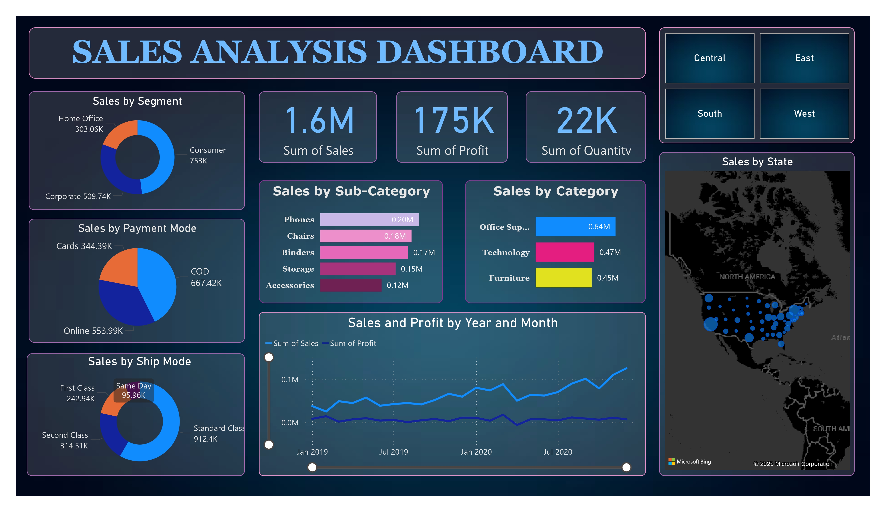
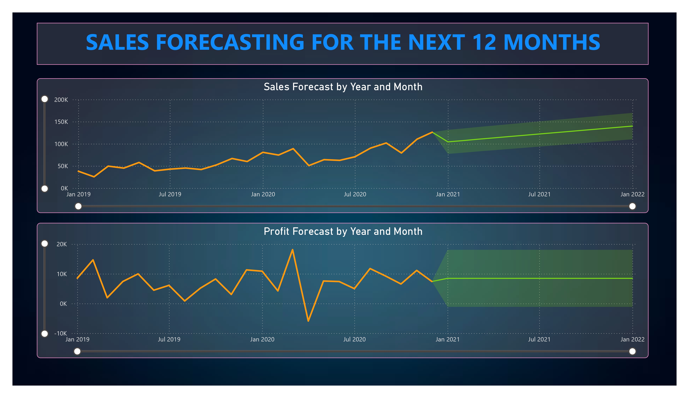

# 📊 Sales Analysis & Forecasting Dashboard 🚀

## 📌 Overview

This project focuses on **analyzing and forecasting sales data** using an interactive **Power BI dashboard**. It helps uncover business insights like category-wise sales, profit trends, and forecasts for the upcoming months, assisting decision-makers in strategic planning.

---

## 🎯 Project Aim

> To create a **dynamic and insightful sales dashboard** that tracks key performance indicators and **forecasts future sales and profit trends** for better business decisions.

---

## ⚙️ How It Works

1. 📥 Imported sales data into Power BI Desktop.
2. 📈 Created visualizations for:
   - Sales by Category, Sub-Category, Segment, State
   - Sales and Profit over time
   - Sales by Payment and Ship Mode
3. 🔮 Applied forecasting models to **predict sales and profit** for the next 12 months.
4. 🌎 Integrated a map for regional sales analysis.

---

## 🔑 Key Features

| Feature | Description |
|--------|-------------|
| 📊 **Sales Breakdown** | Visualize sales and profits across different categories, states, and segments. |
| 📅 **Time-Series Analysis** | Monitor monthly and yearly sales & profit performance. |
| 🔮 **Forecasting** | Predict future sales and profit for the next 12 months. |
| 🛒 **Payment & Shipping Insights** | Analyze preferred payment methods and shipping modes. |
| 🗺️ **Regional Insights** | Understand geographical sales distribution with maps. |

---

## 📋 Project Insights

- **Top-Selling Categories**: Office Supplies had the highest sales, closely followed by Technology and Furniture.
- **High-Performing Sub-Categories**: Phones, Chairs, and Binders are the top-selling sub-categories.
- **Shipping Preferences**: Most customers preferred the Standard Class shipping mode.
- **Payment Insights**: Online and Card payments dominated sales transactions.
- **Regional Sales Distribution**: Central and East regions contributed significantly to overall sales.
- **Forecasted Growth**: Both sales and profit show a steady upward trend for the next year, indicating a positive business outlook.

---

## ❓ Key Business Questions Addressed

- Which product categories and sub-categories contribute most to sales?
- Which segment and payment mode bring in the highest revenue?
- How do sales and profits vary across different states?
- What shipping mode is most preferred by customers?
- What is the sales and profit forecast for the next 12 months?

---

## 📸 Dashboard Snapshots

### 📊 Sales Overview

### 🔮 Forecasting Analysis

## 🙋‍♀️ Created By

**Rashi** — Exploring the power of data-driven storytelling with BI tools 📈✨

---

> _“Transforming raw data into powerful insights for smarter business decisions!”_ 💡
